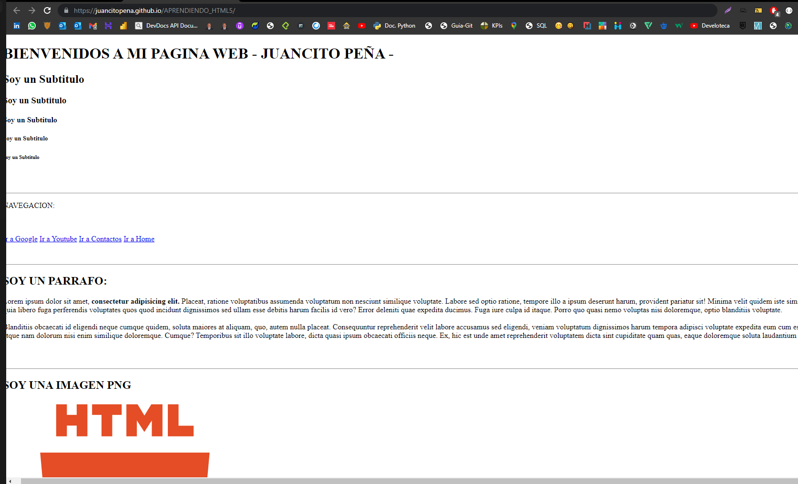

# APRENDIENDO_HTML5
PROYECTO CREADO CON HTML5

## Proyecto en HTML5 
Proyecto asignado de la Materia IHC-1050, Sobre programacion Web con HTML5, Git y GitHub Pages.

## URL; 
https://juancitopena.github.io/APRENDIENDO_HTML5/

### Capruta de Pantalla:

